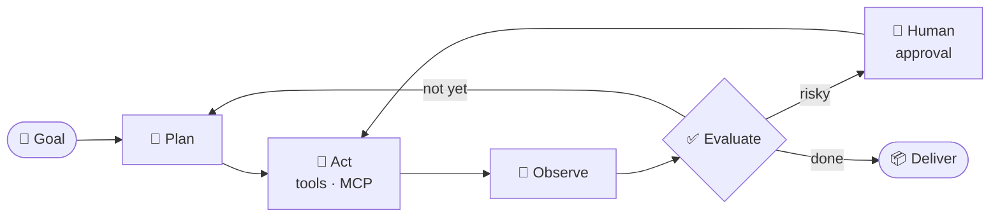

  

  
  
  
  
  

---

### 👋 Hi, I'm Rajesh Gheware

I build **AI agents that run in production**: agents that plan, call tools, remember, check their own work and hand off to a human when they should. I also teach engineers to build them.

- 🏦 **25+ years** of engineering and architecture at **JPMorgan Chase, Deutsche Bank and Morgan Stanley**
- 🎓 **5,000+ engineers trained** in agentic AI, Kubernetes and DevOps, with a **4.91 / 5** rating from Oracle cohorts
- 🧪 **119 hands-on labs** running on a Kubernetes lab platform that I built and operate on my own GPU hardware
- 🍴 My training repos have been **forked 800+ times** by the engineers who worked through them
- 📘 Author of ***Agentic AI: The Practitioner's Guide***, with runnable companion code for every chapter

My rule is simple: an agent isn't finished until it is deployed, traced and evaluated.

---

## 🤖 Agents in production

> ☁️ **In production on Google Cloud:** DiabetCare DMS and finBuddy are live apps with real users. Both store their data in **Cloud Firestore** and sign users in with **Google OAuth**.

<table>
<tr>
<td width="50%" valign="top">

### 🩸 [DiabetCare DMS](https://health.gheware.com)
**Finds the hidden causes of blood-sugar spikes in each patient's own data**

It correlates continuous glucose monitor (CGM) readings with sleep (Google Fit), exercise (Strava) and photo-logged meals. A self-hosted Qwen3.6 model runs six statistical correlation models and turns them into specific, data-referenced recommendations instead of generic advice. It shows medical-grade Ambulatory Glucose Profile and Time-in-Range views, with full data export and one-click deletion.

🧩 **Agent pattern:** data-grounded reasoning. Statistics come first and the LLM explains them, so every insight cites the patient's own numbers.

`Python` `Flask` `Cloud Firestore` `Google Fit` `Qwen3.6 on vLLM` `Kubernetes`
🌐 **[Live app](https://health.gheware.com)** · 📝 [Patient education blog](https://health.gheware.com/blog)

</td>
<td width="50%" valign="top">

### 💹 [finBuddy: Agentic AI for Personal Wealth](https://trade.gheware.com)
**One AI-organised view of a scattered Indian stock portfolio**

You sign in with Google and link Zerodha with **read-only** OAuth. It then builds one dashboard of holdings, P&L and allocation, with AI portfolio-health checks, risk and concentration alerts, AI stock discovery and a portfolio chat. Data is AES-256 encrypted and stays in **Google Cloud Mumbai**. It never places trades and is explicitly not investment advice.

🧩 **Agent pattern:** read-only tools with a human in charge. The agent analyses and raises alerts, but it can never act on the account.

`Spring Boot` `React` `Cloud Firestore` `Redis` `Claude` `Zerodha Kite`
🌐 **[Live app](https://trade.gheware.com)** · 📝 [Investor blog](https://trade.gheware.com/blog)

</td>
</tr>
<tr>
<td width="50%" valign="top">

### 👁️ [Nazar AI](https://github.com/brainupgrade-in/aiforbharat2)
**AI diabetic-retinopathy screening for India's 89.8M diabetics**

A multilingual PWA (English, Hindi, Kannada) for patients and community health workers. A ViT classifier runs on CPU in about 220 ms per image and is tuned for ≥95% sensitivity. It also has a diabetes-advisor chatbot and a dashboard for screening camps.

🧩 **Agent pattern:** a vision model paired with a multilingual advisor that falls back through a chain of models if one fails.

`React` `Hasura` `PostgreSQL` `ViT` `k3s` `Cloudflare`
✅ 38/38 end-to-end tests · 🌐 **[Live demo](https://nazarai.gheware-ai.com/)** · AWS AI for Bharat, Round 2

</td>
<td width="50%" valign="top">

### 🤖 [FrontDesk AI](https://github.com/brainupgrade-in/aiagentic-comp-frontdeskai)
**A self-evolving multi-agent support desk**

An admin describes a new capability in plain English. The system researches the API, writes the Python, validates it and hot-installs it as a skill, all at runtime with no rebuild. A supervisor routes each request to HR, IT, finance or facilities workers, with RAG, escalation and QA checks.

🧩 **Agent pattern:** a supervisor routes work to specialist agents, and a builder agent writes new tools for the others at runtime.

`LangGraph` `FastAPI` `LiteLLM` `ChromaDB` `MCP` `OpenTelemetry`
📦 Multi-arch image · Kubernetes-ready · Langfuse tracing

</td>
</tr>
<tr>
<td width="50%" valign="top">

### 🏦 [Global Bank: agent-driven SDLC](https://github.com/brainupgrade-in/global-bank-platform)
**Autonomous agents that maintain a 7-repo microservices fleet**

A central repo runs GitHub Agentic Workflows that survey six service repos, plan modernisation work, watch for CVEs and file targeted issues in the repo that owns each fix. The fleet was upgraded to Spring Boot 3.5 / JDK 25 and React 19.

🧩 **Agent pattern:** a fleet of scheduled autonomous agents. They survey the repos and file the work, and humans review and merge.

`GitHub Agentic Workflows` `Spring Boot` `React` `Kubernetes` `Jira`

</td>
<td width="50%" valign="top">

### 🎯 [B2B Lead Intelligence](https://github.com/brainupgrade-in/b2b-lead-intelligence)
**From an ideal-customer profile to a ranked, enriched lead list in one run**

It discovers companies across public sources, enriches each one with contacts, tech stack and buying-intent signals, and ranks them 0–100 by fit. It uses only login-free sources.

🧩 **Pattern:** a multi-step pipeline that discovers, enriches and scores leads.

`TypeScript` `Apify` `Vitest`

</td>
</tr>
<tr>
<td colspan="2" valign="top">

### 🧭 [AgentGrow](https://github.com/brainupgrade-in/agentgrow-chrome-extension)
**An open-source AI browser assistant that asks before it acts**

A Chrome extension (Manifest V3) that fills forms, drafts emails, summarises pages and extracts data by reading and writing the live DOM. You bring your own LLM: OpenAI, Anthropic, Gemini, Groq, Ollama, or any OpenAI-compatible endpoint. By default it asks you to approve every click or form fill, and a visible Stop button appears whenever it controls the tab. API keys are encrypted at rest with AES-GCM-256 and it sends no telemetry.

🧩 **Agent pattern:** a browser agent with human-in-the-loop approval on every action.

`TypeScript` `Chrome MV3` `Any LLM` · 🔐 Reproducible builds with published SHA-256 · 🌐 **[Homepage](https://devops.gheware.com/agentgrow/)**

</td>
</tr>
</table>

### 📚 Learn agentic AI from working code

| Repo | What you get |
|---|---|
| [agentic-ai-book-examples](https://github.com/brainupgrade-in/agentic-ai-book-examples) | 100+ runnable files for the book: LangChain, LangGraph, RAG, multi-agent systems, MCP, safety |
| [biaa-healthcare](https://github.com/brainupgrade-in/biaa-healthcare) | A LangGraph two-agent app that turns discharge summaries into plain language without inventing advice |
| [build-your-first-ai-agent](https://github.com/brainupgrade-in/build-your-first-ai-agent) | A from-scratch Python agent with tools and memory, covered by 70 tests |
| [langchain-examples](https://github.com/brainupgrade-in/langchain-examples) | LCEL chains, RAG, memory, tools and streaming, all runnable on free LLM tiers |
| [claude-skills-examples](https://github.com/brainupgrade-in/claude-skills-examples) | Reusable agent skills for DevOps, finance and e-commerce |
| [askops](https://github.com/brainupgrade-in/askops) | A test-driven FastAPI codebase for learning to build with AI coding agents |

### 🏫 Enterprise courses: [@ghewaredevopsai](https://github.com/ghewaredevopsai)

My training organisation publishes the course material I deliver to enterprise engineering teams:

| Course | Focus |
|---|---|
| [agentic-workflows-multi-agent-systems](https://github.com/ghewaredevopsai/agentic-workflows-multi-agent-systems) | A 3-day advanced course on multi-agent orchestration, with delivery decks and labs |
| [adlc-with-github-copilot-ticket-to-pr](https://github.com/ghewaredevopsai/adlc-with-github-copilot-ticket-to-pr) | The agentic development lifecycle: from a ticket to a merged PR with coding agents |
| [prompt-context-engineering](https://github.com/ghewaredevopsai/prompt-context-engineering) | The six parts of a prompt, output contracts, and patterns for managing context |
| [token-optimization](https://github.com/ghewaredevopsai/token-optimization) | Where the tokens go, choosing a model per use case, routing and caching |

---

## 🧱 The agent stack I ship

Each layer of a production agent, and what I use for it:

| Layer | Tools |
|---|---|
| **🧠 Reasoning** |     |
| **🕸️ Orchestration** |    |
| **🔧 Tools & protocols** |    |
| **📚 Memory & knowledge** |     |
| **🛡️ Guardrails & evals** |    |
| **🔭 Observability** |     |
| **☸️ Runtime** |      |

---

## 🔁 How I build agents

| Principle | In practice |
|---|---|
| **Ground it** | Agents reason over real data and tool results, and cite them, rather than answering from the model's memory |
| **Guard it** | Read-only tools by default, human approval before risky actions, and fallback chains when a model fails |
| **Evaluate it** | Agent behaviour is pinned by tests and evaluation sets, not by "it worked once" |
| **Observe it** | Every step is traced with OpenTelemetry and Langfuse; tokens, latency and cost per agent appear on Grafana |
| **Ship it** | Container images, Kubernetes manifests, self-hosted models on a DGX Spark, and LiteLLM failover between providers |

---

  <b>Building something with agents?</b> Let's talk: <a href="https://devops.gheware.com">devops.gheware.com</a>

