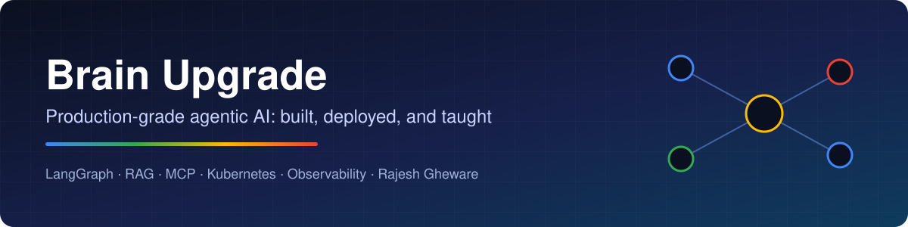

  

  
  
  
  

---

### 👋 Hi, I'm Rajesh Gheware

I build **AI agents that run in production**, and I teach engineers to do the same.

- 🏦 **25+ years** of engineering and architecture at **JPMorgan Chase, Deutsche Bank and Morgan Stanley**
- 🎓 **5,000+ engineers trained** in agentic AI, Kubernetes and DevOps, with a **4.91 / 5** rating from Oracle cohorts
- 🧪 **119 hands-on labs** running on a Kubernetes lab platform that I built and operate on my own GPU hardware
- 🍴 My training repos have been **forked 800+ times** by the engineers who worked through them
- 📘 Author of ***Agentic AI: The Practitioner's Guide***, with runnable companion code for every chapter

My rule is simple: if it isn't deployed, observed and tested, it isn't finished.

---

## 🚀 Featured projects

<table>
<tr>
<td width="50%" valign="top">

### 👁️ [Nazar AI](https://github.com/brainupgrade-in/aiforbharat2)
**AI diabetic-retinopathy screening for India's 89.8M diabetics**

A multilingual PWA (English, Hindi, Kannada) for patients and community health workers. A ViT classifier runs on CPU in about 220 ms per image and is tuned for ≥95% sensitivity. It also has a diabetes-advisor chatbot and a dashboard for screening camps.

`React` `Hasura` `PostgreSQL` `ViT` `k3s` `Cloudflare`
✅ 38/38 end-to-end tests · 🌐 **[Live demo](https://nazarai.gheware-ai.com/)** · AWS AI for Bharat, Round 2

</td>
<td width="50%" valign="top">

### 🤖 [FrontDesk AI](https://github.com/brainupgrade-in/aiagentic-comp-frontdeskai)
**A self-evolving multi-agent support desk**

An admin describes a new capability in plain English. The system researches the API, writes the Python, validates it and hot-installs it as a skill, all at runtime with no rebuild. A supervisor routes each request to HR, IT, finance or facilities workers, with RAG, escalation and QA checks.

`LangGraph` `FastAPI` `LiteLLM` `ChromaDB` `MCP` `OpenTelemetry`
📦 Multi-arch image · Kubernetes-ready · Langfuse tracing

</td>
</tr>
<tr>
<td width="50%" valign="top">

### 🏦 [Global Bank: agent-driven SDLC](https://github.com/brainupgrade-in/global-bank-platform)
**Autonomous agents that maintain a 7-repo microservices fleet**

A central repo runs GitHub Agentic Workflows that survey six service repos, plan modernisation work, watch for CVEs and file targeted issues in the repo that owns each fix. The fleet was upgraded to Spring Boot 3.5 / JDK 25 and React 19.

`GitHub Agentic Workflows` `Spring Boot` `React` `Kubernetes` `Jira`

</td>
<td width="50%" valign="top">

### 🎯 [B2B Lead Intelligence](https://github.com/brainupgrade-in/b2b-lead-intelligence)
**From an ideal-customer profile to a ranked, enriched lead list in one run**

It discovers companies across public sources, enriches each one with contacts, tech stack and buying-intent signals, and ranks them 0–100 by fit. It uses only login-free sources.

`TypeScript` `Apify` `Vitest`

</td>
</tr>
</table>

### 📚 Learn agentic AI from working code

| Repo | What you get |
|---|---|
| [agentic-ai-book-examples](https://github.com/brainupgrade-in/agentic-ai-book-examples) | 100+ runnable files for the book: LangChain, LangGraph, RAG, multi-agent systems, MCP, safety |
| [biaa-healthcare](https://github.com/brainupgrade-in/biaa-healthcare) | A LangGraph two-agent app that turns discharge summaries into plain language without inventing advice |
| [build-your-first-ai-agent](https://github.com/brainupgrade-in/build-your-first-ai-agent) | A from-scratch Python agent with tools and memory, covered by 70 tests |
| [langchain-examples](https://github.com/brainupgrade-in/langchain-examples) | LCEL chains, RAG, memory, tools and streaming, all runnable on free LLM tiers |
| [claude-skills-examples](https://github.com/brainupgrade-in/claude-skills-examples) | Reusable agent skills for DevOps, finance and e-commerce |
| [askops](https://github.com/brainupgrade-in/askops) | A test-driven FastAPI codebase for learning to build with AI coding agents |

### 🏫 Enterprise courses: [@ghewaredevopsai](https://github.com/ghewaredevopsai)

My training organisation publishes the course material I deliver to enterprise engineering teams:

| Course | Focus |
|---|---|
| [agentic-workflows-multi-agent-systems](https://github.com/ghewaredevopsai/agentic-workflows-multi-agent-systems) | A 3-day advanced course on multi-agent orchestration, with delivery decks and labs |
| [adlc-with-github-copilot-ticket-to-pr](https://github.com/ghewaredevopsai/adlc-with-github-copilot-ticket-to-pr) | The agentic development lifecycle: from a ticket to a merged PR with coding agents |
| [prompt-context-engineering](https://github.com/ghewaredevopsai/prompt-context-engineering) | The six parts of a prompt, output contracts, and patterns for managing context |
| [token-optimization](https://github.com/ghewaredevopsai/token-optimization) | Where the tokens go, choosing a model per use case, routing and caching |

---

## 🛠️ What I build with

**Agents & LLMs** 

**Backend & frontend** 

**Platform & operations** 

---

## 🧭 How I build

| Principle | In practice |
|---|---|
| **Ship it** | Projects ship as container images with deployment manifests, and the flagship ones run live |
| **Observe it** | Agents are traced with OpenTelemetry and Langfuse; tokens, latency and cost appear on Grafana dashboards |
| **Test it** | Agent behaviour is pinned by tests and evaluation sets, not by "it worked once" |
| **Own the stack** | Self-hosted LLMs on a DGX Spark, LiteLLM failover between providers, per-agent keys and budgets |

---

  <b>Building something with agents?</b> Let's talk: <a href="https://devops.gheware.com">devops.gheware.com</a>

